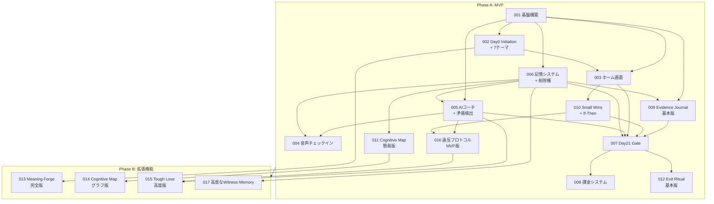

# VowArc チケット概要

## プロジェクト概要

**Product Name**: VowArc
**Tagline**: 意志を、物語に変える（Turn your vow into a narrative arc.）

3ヶ月成果コミット型コーチングアプリ。AIを証人（Witness）として用い、ユーザーが志を編纂し、12週間で定量成果を創出することを支援する。

---

## チケット分類

### Phase A: MVP（必須機能）

requirements.mdで「必須」と定義された機能群。最小限の実装でMVPを構築する。

| チケット | 概要 | 優先度 | 状態 |
|---------|------|--------|------|
| [001-foundation](./001-foundation.md) | 基盤構築（認証、DB設計、API設定） | 最高 | ✅ 完了 |
| [002-day0-initiation](./002-day0-initiation.md) | Day 0 オンボーディング・心理的契約・**Meaning Statement生成** | 高 | ✅ 完了 |
| [003-home-screen](./003-home-screen.md) | ホーム画面（北極星・最小コミット表示） | 高 | ✅ 完了 |
| [004-voice-checkin](./004-voice-checkin.md) | 音声チェックイン機能 | 高 | ✅ 完了 |
| [005-ai-coach-basic](./005-ai-coach-basic.md) | AIコーチ基本機能（**矛盾検出・介入設定基本版含む**） | 高 | ✅ 完了 |
| [006-memory-system](./006-memory-system.md) | 二層記憶システム（Mutable/Immutable分離） | 高 | ✅ 完了 |
| [007-day21-judgment-gate](./007-day21-judgment-gate.md) | Day 21 継続判断儀式（Commitment Report） | 高 | ✅ 完了 |
| [008-payment-system](./008-payment-system.md) | 課金システム（Day10登録・Day21**一括払い**） | 高 | 未着手 |
| [009-evidence-journal-basic](./009-evidence-journal-basic.md) | Evidence Journal（基本版：画像/URL/メモ保存） | 高 | ✅ 完了 |
| [010-small-wins-basic](./010-small-wins-basic.md) | Small Wins Dashboard（基本版：**If-Then発動率含む**プロセスメトリクス） | 中 | ✅ 完了 |
| [011-cognitive-map-basic](./011-cognitive-map-basic.md) | Cognitive Map（簡易版：リスト形式） | 中 | 未着手 |
| [012-exit-ritual-basic](./012-exit-ritual-basic.md) | Exit Ritual（基本版：学び回収・解約レビュー） | 中 | 未着手 |
| [016-violation-protocol](./016-violation-protocol.md) | **契約違反プロトコル（MVP版：Warning→Renegotiation）** | 中 | 未着手 |

### Phase B: 拡張機能

MVP完成後に追加する高度な機能群。

| チケット | 概要 | 優先度 |
|---------|------|--------|
| [013-meaning-forge-full](./013-meaning-forge-full.md) | Meaning Forge（完全版：7テーマ深掘りインタビュー） | 中 |
| [014-cognitive-map-graph](./014-cognitive-map-graph.md) | Cognitive Map（グラフ描画版：ノード・エッジ可視化） | 中 |
| [015-tough-love-advanced](./015-tough-love-advanced.md) | Tough Love / Soft Redirection（高度版） | 低 |
| [017-advanced-witness-memory](./017-advanced-witness-memory.md) | 高度なWitness Memory（介入設定透明性・**削除権UI**） | 低 |

---

## 依存関係図

---

## 依存関係の説明

### Phase A 内部依存

1. **001 基盤構築** → 全てのチケットの前提
   - 認証、DB、ストレージがなければ何も動かない

2. **002 Day0 Initiation** → 003 ホーム画面
   - Meaning Statement生成を含む（ホームで表示するため）
   - オンボーディング完了後にホームへ遷移

3. **006 記憶システム** → 005 AIコーチ, 009 Evidence, 011 Map
   - AIが過去の発言を参照するために記憶が必要
   - Evidence/Mapも記憶と連携

4. **009 Evidence Journal** → 007 Day21 Gate
   - Day21のCommitment Reportで証拠のハイライトを表示

5. **010 Small Wins** → 007 Day21 Gate
   - Day21の行動継続ティア表示に必要

6. **007 Day21 Gate** → 008 課金, 012 Exit Ritual
   - 継続選択 → 課金
   - 停止選択 → Exit Ritual

7. **016 契約違反プロトコル（MVP版）** ← 追加
   - 前提: 005 AIコーチ基本, 010 Small Wins基本
   - Warning → Renegotiation まで実装（Termination Offerは手動対応）

### Phase A → B 依存

- **002 Day0（7テーマ）** → 013 Meaning Forge完全版: 基本7テーマ→深掘りインタビューへ拡張
- **011 Map簡易版** → 014 Map グラフ版: リスト→グラフ描画へ拡張
- **005 AIコーチ** → 015 Tough Love高度版: 基本→高度な介入へ拡張
- **006 記憶（削除権含む）** → 017 高度なWitness Memory: 削除権UI・透明性管理の強化
- **016 違反プロトコル（MVP版）** → 015 Tough Love高度版: MVP版→高度版への統合（逆依存）

---

## 並行開発ガイドライン

### 同時開発可能なチケット

**Phase A 初期（001完了後）:**
- 002, 003, 005, 006, 009 は並行開発可能

**Phase A 中期:**
- 004 は 005, 006 完了後に開始
- 010, 011 は 003, 006 完了後に開始
- 007 は 005, 006, 009, 010 完了後に開始

**Phase A 後期:**
- 008 は 007 完了後に開始
- 012 は 007 完了後に開始
- 016 は 005, 010 完了後に開始（並行開発可能）

**Phase B:**
- 013, 014, 017 は並行開発可能
- 015 は 016（MVP版）完了後に開始（高度版への拡張）

### Claude Code 並行開発時の注意

1. 各チケットは独立したブランチで作業
2. 共通コンポーネント（types, utils）は 001 で定義
3. コンフリクトが起きやすい箇所:
   - `app/_layout.tsx`
   - `constants/` 配下
   - 共通hooks

---

## 課金モデル

| 期間 | 料金 |
|------|------|
| Day 1-21（トライアル） | 無料 |
| Week 4-12（有料期間：9週間） | 一括払い（金額要決定） |

- Day 10: 決済情報登録（任意、課金なし）
- Day 21: 継続選択時に9週間分を一括課金

---

## ステータス管理

各チケットファイル内のTodoで進捗を管理:
- [ ] 未着手
- [x] 完了

実装完了後は各チケットのTodoを更新すること。
